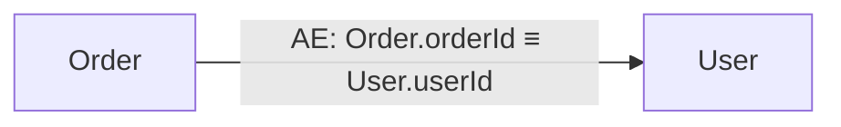

# classRelation — 项目技术文档

> 版本：1.0-SNAPSHOT | 语言：Java 21 | 核心依赖：JavaParser 3.26.4

---

## 1. 项目定位

`classRelation` 是一个 **Java 源码静态分析工具**，目标是自动探测项目中类与类之间基于 `equals()` 调用所隐含的字段关联关系（Field Lineage）。

其理论基础对应 `readeMe.md` 中定义的 **元属性逻辑关联协议（MALM）** 的"探测型关联（Read-Only Predicate）"分支：工具不改写源码，只读取并推断字段之间的等值语义。

---

## 2. 分析流水线

```
projectRoot (目录)
    │
    ▼
[JavaFileScanner]          扫描所有 .java 文件
    │
    ▼
[StaticJavaParser]         解析每个文件为 AST（CompilationUnit）
    │  + SymbolSolver（类型推导）
    ▼
[EqualsCallVisitor]        遍历 AST，收集所有 caller.equals(arg) 调用点
    │  → List<EqualCallSite>
    ▼
[FieldRefExtractor]        分析 caller / arg 两侧表达式，提取字段引用
    │  → ExpressionSide (leftSide, rightSide)
    ▼
[RelationshipClassifier]   将两侧关系分类为 ATOMIC / COMPOSITE / PARAMETERIZED
    │  → MappingType
    ▼
[LineageGraph]             聚合：按 "SourceClass->TargetClass" 合并 FieldMapping
    │  → List<ClassRelation>
    ▼
[MermaidRenderer]          输出 Mermaid 流程图
[TableRenderer]            输出 ASCII 表格（目标字段 | 源字段 | 类型 | 位置）
```

---

## 3. 核心模块说明

### 3.1 数据模型层 (`org.example.model`)

| 类型 | 职责 |
|---|---|
| `FieldRef` | 单个字段引用：`className + fieldName`，className 可为 null（类型推导失败时） |
| `ExpressionSide` | equals() 一侧的完整表达式：多个 FieldRef + 算子描述（direct / concat / format / transform） |
| `FieldMapping` | 一次 equals() 调用的完整记录：leftSide、rightSide、MappingType、rawExpression、代码位置 |
| `ClassRelation` | 两个类之间所有 FieldMapping 的聚合：sourceClass → targetClass → mappings |
| `MappingType` | 枚举：ATOMIC / COMPOSITE / PARAMETERIZED |

**数据流向**：`FieldRef` → `ExpressionSide` → `FieldMapping` → `ClassRelation`

---

### 3.2 分析层 (`org.example.analyzer`)

#### `JavaFileScanner`
- 使用 `Files.walkFileTree` 递归扫描目录
- 过滤 `.java` 后缀文件
- 访问失败时记录 WARNING 并继续（不中断整体分析）

#### `FieldRefExtractor` ⭐ 核心
识别表达式中的字段引用，支持三类模式：

| 模式 | 示例 | operator |
|---|---|---|
| 直接字段访问 | `obj.fieldName` | `direct` |
| 拼接组合 | `a.f1 + a.f2`、`String.concat(...)` | `concat` |
| 格式化 | `String.format(...)` | `format` |
| 变换链 | `getXxx().transform()` | `transform` |

类名解析优先使用 SymbolSolver 类型推导，失败时降级为 scope 文本启发式提取。

#### `LineageAnalyzer` ⭐ 编排者
实现完整 Pipeline 的编排，包含：
- SymbolSolver 初始化（支持跨文件类型解析）
- 逐文件解析 + 异常隔离（单文件失败不影响全局）
- 过滤无效 CallSite：双侧均无字段引用、任一侧无法解析类名

---

### 3.3 访问者层 (`org.example.visitor`)

#### `EqualsCallVisitor`
基于 JavaParser `VoidVisitorAdapter`，匹配规则：
- 方法名 == `"equals"`
- 参数数量 == 1
- 存在 scope（排除静态 `Objects.equals(a, b)` 形式）

每个匹配点封装为 `EqualCallSite` record，携带 caller、argument、完整 MethodCallExpr、代码位置字符串。

---

### 3.4 分类层 (`org.example.classifier`)

#### `RelationshipClassifier`
分类优先级（高到低）：

```
有 transform 算子  →  PARAMETERIZED（参数化动态关联）
有 concat/format 或字段数 > 1  →  COMPOSITE（投影组合关联）
其余  →  ATOMIC（原子等值关联）
```

与 MALM 协议的映射关系：

| MappingType | MALM 模式 |
|---|---|
| ATOMIC | 原子等值 (Atomic Equality) |
| COMPOSITE | 投影组合关联 (Composite Projection) |
| PARAMETERIZED | 参数化动态关联 (Parametric/Variable) |

---

### 3.5 图结构层 (`org.example.graph`)

#### `LineageGraph`
- 内部结构：`Map<"SrcClass->TgtClass", List<FieldMapping>>`
- 支持多字段跨类笛卡尔积（左侧 N 个类 × 右侧 M 个类）
- 过滤自关联（`src.equals(tgt)` 时跳过）

---

### 3.6 渲染层 (`org.example.renderer`)

#### `MermaidRenderer`
输出格式：

标签前缀：`AE`（ATOMIC）、`CP`（COMPOSITE）、`PD`（PARAMETERIZED）

#### `TableRenderer`
输出格式（含中文列头、中文字符宽度补偿）：
```
+----------------+----------------+--------+-----------------------+
| 目标表字段      | 源表字段集合    | 映射类型 | 代码位置              |
+----------------+----------------+--------+-----------------------+
| Account.mobile | User.phone     | ATOMIC  | OrderService.java:42  |
+----------------+----------------+--------+-----------------------+
```

---

## 4. 入口与使用方式

### 构建
```bash
mvn package
# 生成 target/classRelation-1.0-SNAPSHOT-jar-with-dependencies.jar
```

### 运行
```bash
java -jar target/classRelation-1.0-SNAPSHOT-jar-with-dependencies.jar <被分析项目根路径>
```

### 输出
标准输出依次打印：
1. Mermaid 流程图（可直接粘贴到支持 Mermaid 的 Markdown 渲染器）
2. ASCII 字段关联表

---

## 5. 当前能力边界

| 能力 | 支持情况 |
|---|---|
| `caller.equals(arg)` 模式 | ✅ |
| 跨文件类型解析（SymbolSolver） | ✅（失败时降级） |
| `Objects.equals(a, b)` 静态形式 | ❌ 未支持 |
| `null` 安全性（MALM Null-Safety） | ❌ 未建模 |
| 动态绑定 / 运行时变量 | ❌ 静态分析无法覆盖 |
| 赋值型关联（MALM 动作型） | ❌ 未支持 |

---

## 6. 包结构一览

```
org.example
├── Main.java                         入口，参数校验 + 渲染调度
├── model/
│   ├── FieldRef.java                 字段引用（类名 + 字段名）
│   ├── ExpressionSide.java           表达式侧（字段集合 + 算子）
│   ├── FieldMapping.java             单次 equals() 映射记录
│   ├── ClassRelation.java            类间聚合关系
│   └── MappingType.java              ATOMIC / COMPOSITE / PARAMETERIZED
├── analyzer/
│   ├── JavaFileScanner.java          目录递归扫描
│   ├── FieldRefExtractor.java        表达式字段引用提取
│   └── LineageAnalyzer.java          全流水线编排
├── visitor/
│   ├── EqualCallSite.java            equals() 调用点 record
│   └── EqualsCallVisitor.java        AST visitor
├── classifier/
│   └── RelationshipClassifier.java   关联类型分类
├── graph/
│   └── LineageGraph.java             类关联图聚合
└── renderer/
    ├── MermaidRenderer.java          Mermaid 输出
    └── TableRenderer.java            ASCII 表格输出
```
