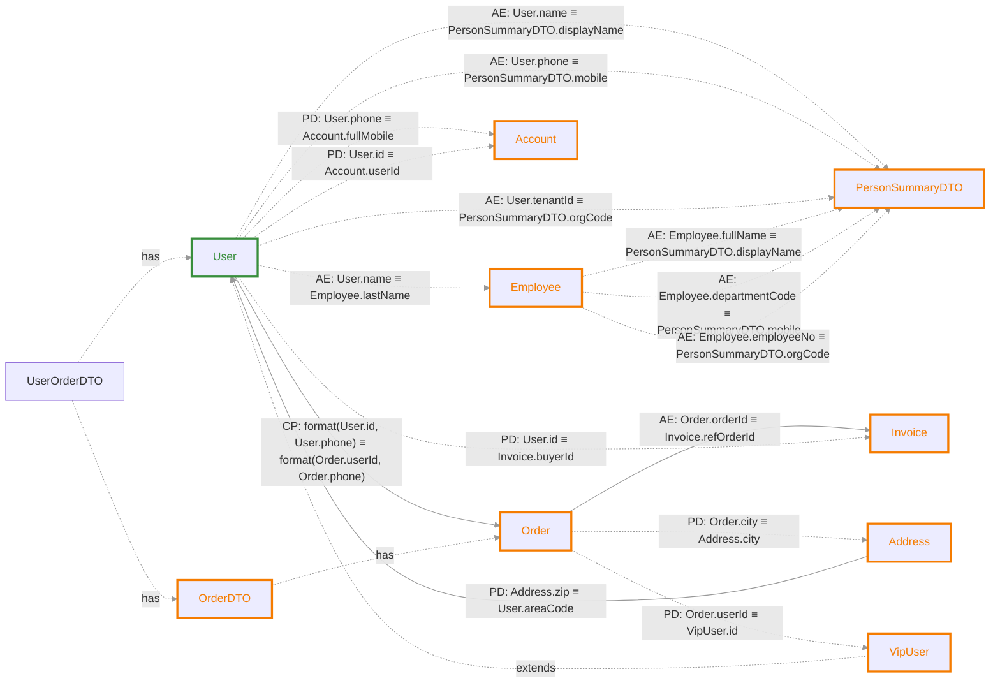
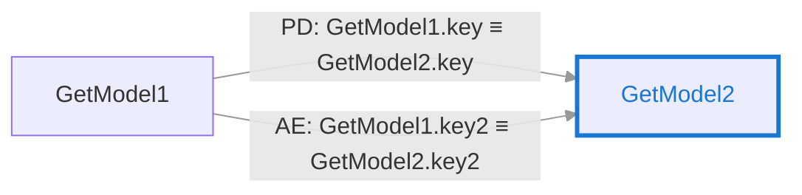
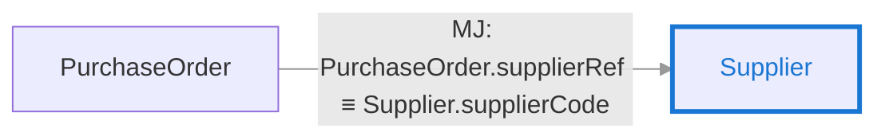
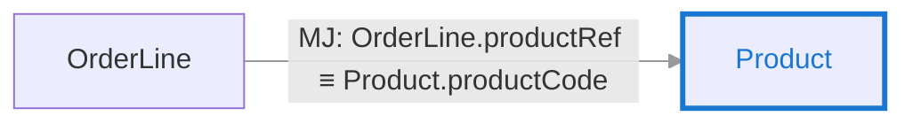

# classRelationTestCode — 字段关联分析报告

## 摘要

| 项目 | 数值 |
|---|---|
| 涉及类关系对（直接） | 21 |
| 探测型关联（READ） | 13 |
| 动作型关联（WRITE） | 32 |
| 推导关联（传递闭包） | 1 |

## 关联图谱

> 实线箭头 `-->` 为探测型（READ），虚线箭头 `-.->` 为动作型（WRITE）。

### 关系类型说明

| 缩写 | 全称 | 含义 | 示例 |
|---|---|---|---|
| **AE** | Atomic Equality | 原子等值：单字段对单字段的直接映射 | `A.id ≡ B.userId` |
| **CP** | Composite Projection | 投影组合：多字段组合或拼接后的映射 | `A.f1 + A.f2 ≡ B.full` |
| **PD** | Parameterized / Derived | 参数化/派生：经过转换、归一化或依赖上下文的映射 | `A.code.toLowerCase() ≡ B.value` |

### 继承关系

| 子类 | 父类 | 继承字段 |
|---|---|---|
| `VipUser` | `User` | `areaCode, phone, tenantId, id, name` |

## 字段血缘明细

### Employee

| 目标字段 | 源表字段集合 | 映射类型 | 模式 | 代码位置 | 归一化操作 |
|---|---|---|---|---|---|
| `lastName` | `User.name` | ATOMIC | WRITE | `RecursiveCallTest.java:28` |
| | *employee.setLastName(user.getName())* | | | |

### Order

| 目标字段 | 源表字段集合 | 映射类型 | 模式 | 代码位置 | 归一化操作 |
|---|---|---|---|---|---|
| `phone, userId` | `User.id`, `User.phone` | COMPOSITE | READ | `CompositeProjectionTest.java:21` |
| | *userAndPhone.equals(orderAndPhone)* | | | |

### Invoice

| 目标字段 | 源表字段集合 | 映射类型 | 模式 | 代码位置 | 归一化操作 |
|---|---|---|---|---|---|
| `buyerId` | `User.id` | PARAMETERIZED | WRITE | `fillInvoice(projected)` |
| | *// 这里建立映射：userId -> invoice.buyerId, orderId -> invoice.refOrderId invoice.setBuyerId(userId)* | | | |
| `refOrderId` | `Order.orderId` | ATOMIC | READ | `AtomicEqualityTest.java:19` |
| | *order.getOrderId().equals(invoice.getRefOrderId())* | | | |

### Catalog

| 目标字段 | 源表字段集合 | 映射类型 | 模式 | 代码位置 | 归一化操作 |
|---|---|---|---|---|---|
| `catalogCode` | `Goods.catalogRef` | ATOMIC | READ | `ImplicitEqualityTest.java:80` |
| | *g.getCatalogRef().equals(catalog.getCatalogCode())* | | | |

### User

| 目标字段 | 源表字段集合 | 映射类型 | 模式 | 代码位置 | 归一化操作 |
|---|---|---|---|---|---|
| `areaCode` | `Address.zip` | PARAMETERIZED | READ | `NormalizationTest.java:16` | `toLowerCase()` |
| | *address.getZip().toLowerCase().equals(user.getAreaCode())* | | | |

### GetModel2

| 目标字段 | 源表字段集合 | 映射类型 | 模式 | 代码位置 | 归一化操作 |
|---|---|---|---|---|---|
| `key` | `GetModel1.key` | PARAMETERIZED | READ | `GetTest.java:19` |
| | *model1s.get(0).getKey().equals(model2s.get(0).getKey())* | | | |
| `key2` | `GetModel1.key2` | ATOMIC | READ | `GetTest.java:23` |
| | *model1s1[0].getKey2().equals(model1s2[0].getKey2())* | | | |

### PersonSummaryDTO

| 目标字段 | 源表字段集合 | 映射类型 | 模式 | 代码位置 | 归一化操作 |
|---|---|---|---|---|---|
| `displayName` | `User.name` | ATOMIC | WRITE | `MultiSourceMappingTest.java:20` |
| | *dto.setDisplayName(user.getName())* | | | |
|  | `Employee.fullName` | ATOMIC | WRITE | `MultiSourceMappingTest.java:28` |
| | *dto.setDisplayName(emp.getFullName())* | | | |
| `mobile` | `User.phone` | ATOMIC | WRITE | `MultiSourceMappingTest.java:21` |
| | *dto.setMobile(user.getPhone())* | | | |
|  | `Employee.departmentCode` | ATOMIC | WRITE | `MultiSourceMappingTest.java:29` |
| | *dto.setMobile(emp.getDepartmentCode())* | | | |
| `orgCode` | `User.tenantId` | ATOMIC | WRITE | `MultiSourceMappingTest.java:22` |
| | *dto.setOrgCode(user.getTenantId())* | | | |
|  | `Employee.employeeNo` | ATOMIC | WRITE | `MultiSourceMappingTest.java:30` |
| | *dto.setOrgCode(emp.getEmployeeNo())* | | | |

### Address

| 目标字段 | 源表字段集合 | 映射类型 | 模式 | 代码位置 | 归一化操作 |
|---|---|---|---|---|---|
| `city` | `Order.city` | PARAMETERIZED | WRITE | `buildAddressFromOrder(builder)` |
| | *Address.builder().city(orderDTO.getOrder().getCity())* | | | |

### Account

| 目标字段 | 源表字段集合 | 映射类型 | 模式 | 代码位置 | 归一化操作 |
|---|---|---|---|---|---|
| `fullMobile` | `User.phone` | PARAMETERIZED | WRITE | `createAccountFromUser(constructor-call)` |
| | *new Account(userOrderDTO.getUser().getPhone(), userOrderDTO.getUser().getId())* | | | |
| `userId` | `User.id` | PARAMETERIZED | WRITE | `createAccountFromUser(constructor-call)` |
| | *new Account(userOrderDTO.getUser().getPhone(), userOrderDTO.getUser().getId())* | | | |

### ItemDetail

| 目标字段 | 源表字段集合 | 映射类型 | 模式 | 代码位置 | 归一化操作 |
|---|---|---|---|---|---|
| `item` | `Item.item` | PARAMETERIZED | WRITE | `testGeneric(builder)` |
| | *ItemDetail.builder().item(item)* | | | |

### Bottom

| 目标字段 | 源表字段集合 | 映射类型 | 模式 | 代码位置 | 归一化操作 |
|---|---|---|---|---|---|
| `manufacturer` | `Enterprise.name` | MAP_JOIN | READ | `testGeneric(implicit-map-join)` |
| | *nameMapProduct.forEach((name, product) -> {     productMapImg.put(product, nameMapImg.get(name)); })* | | | |

### Supplier

| 目标字段 | 源表字段集合 | 映射类型 | 模式 | 代码位置 | 归一化操作 |
|---|---|---|---|---|---|
| `supplierCode` | `PurchaseOrder.supplierRef` | MAP_JOIN | READ | `testDirectGetterBridge(implicit-map-join)` |
| | *supplierRegionMap.get(purchaseOrder.getSupplierRef())* | | | |

### Product

| 目标字段 | 源表字段集合 | 映射类型 | 模式 | 代码位置 | 归一化操作 |
|---|---|---|---|---|---|
| `productCode` | `OrderLine.productRef` | MAP_JOIN | READ | `testExplicitPutGet(implicit-map-join)` |
| | *productNameMap.get(orderLine.getProductRef())* | | | |

### Contract

| 目标字段 | 源表字段集合 | 映射类型 | 模式 | 代码位置 | 归一化操作 |
|---|---|---|---|---|---|
| `contractNo` | `Payment.refContractNo` | MAP_JOIN | READ | `testGetterAssignmentBridge(implicit-map-join)` |
| | *contractClientMap.get(lookupKey)* | | | |

### Staff

| 目标字段 | 源表字段集合 | 映射类型 | 模式 | 代码位置 | 归一化操作 |
|---|---|---|---|---|---|
| `deptCode` | `Department.departmentId` | MAP_JOIN | READ | `testGroupingByBridge(implicit-map-join)` |
| | *deptMap.get(department.getDepartmentId())* | | | |

### VipUser

| 目标字段 | 源表字段集合 | 映射类型 | 模式 | 代码位置 | 归一化操作 |
|---|---|---|---|---|---|
| `id` | `Order.userId` | PARAMETERIZED | WRITE | `testVipUserInheritedFields(direct-setter)` |
| | *// VipUser 继承自 User，可以使用 id 字段 vipUser.setId(orderDTO.getOrder().getUserId())* | | | |

## 推导关联（传递性闭包）

> 以下关联由工具自动推导，非源码直接体现。

### VipUser

| 目标字段 | 源表字段集合 | 推导路径 |
|---|---|---|
| id | `User.id`, `User.phone` | *[User.id, User.phone] → [Order.userId, Order.phone] → VipUser.id* |

