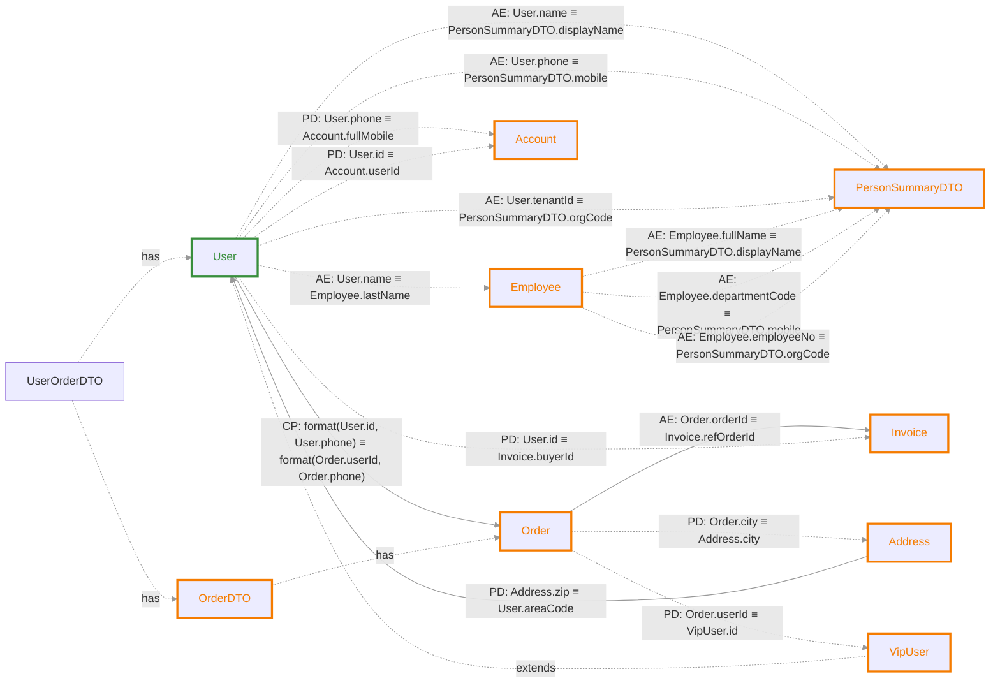
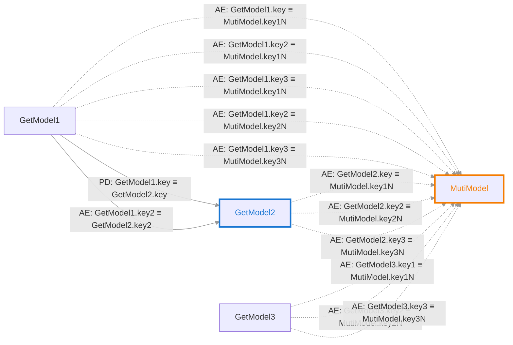
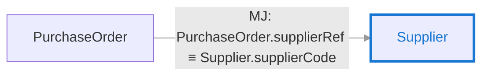
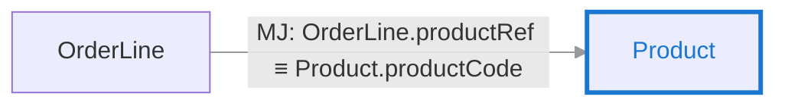

# classRelationTestCode — 字段关联分析报告

## 摘要

| 项目 | 数值 |
|---|---|
| 涉及类关系对（直接） | 24 |
| 探测型关联（READ） | 13 |
| 动作型关联（WRITE） | 54 |
| 推导关联（传递闭包） | 1 |

## 关联图谱

> 实线箭头 `-->` 为探测型（READ），虚线箭头 `-.->` 为动作型（WRITE）。

### 关系类型说明

| 缩写 | 全称 | 含义 | 示例 |
|---|---|---|---|
| **AE** | Atomic Equality | 原子等值：单字段对单字段的直接映射 | `A.id ≡ B.userId` |
| **CP** | Composite Projection | 投影组合：多字段组合或拼接后的映射 | `A.f1 + A.f2 ≡ B.full` |
| **PD** | Parameterized / Derived | 参数化/派生：经过转换、归一化或依赖上下文的映射 | `A.code.toLowerCase() ≡ B.value` |

### 继承关系

| 子类 | 父类 | 继承字段 |
|---|---|---|
| `VipUser` | `User` | `areaCode, phone, tenantId, id, name` |

## 字段血缘明细

### Account

| 目标字段 | 源端字段 | 代码位置 | 代码块 |
|---|---|---|---|
| `fullMobile` | `User.phone` | `createAccountFromUser(constructor-call)` | new Account(userOrderDTO.getUser().getPhone(), userOrderDTO.getUser().getId()) |
| `userId` | `User.id` | `createAccountFromUser(constructor-call)` | new Account(userOrderDTO.getUser().getPhone(), userOrderDTO.getUser().getId()) |

### Address

| 目标字段 | 源端字段 | 代码位置 | 代码块 |
|---|---|---|---|
| `city` | `Order.city` | `buildAddressFromOrder(builder)` | Address.builder().city(orderDTO.getOrder().getCity()) |

### Bottom

| 目标字段 | 源端字段 | 代码位置 | 代码块 |
|---|---|---|---|
| `manufacturer` | `Enterprise.name` | `testGeneric(implicit-map-join)` | nameMapProduct.forEach((name, product) -> {     productMapImg.put(product, nameMapImg.get(name)); }) |

### Catalog

| 目标字段 | 源端字段 | 代码位置 | 代码块 |
|---|---|---|---|
| `catalogCode` | `Goods.catalogRef` | `ImplicitEqualityTest.java:80` | g.getCatalogRef().equals(catalog.getCatalogCode()) |

### Contract

| 目标字段 | 源端字段 | 代码位置 | 代码块 |
|---|---|---|---|
| `contractNo` | `Payment.refContractNo` | `testGetterAssignmentBridge(implicit-map-join)` | contractClientMap.get(lookupKey) |

### Employee

| 目标字段 | 源端字段 | 代码位置 | 代码块 |
|---|---|---|---|
| `lastName` | `User.name` | `RecursiveCallTest.java:28` | employee.setLastName(user.getName()) |

### GetModel2

| 目标字段 | 源端字段 | 代码位置 | 代码块 |
|---|---|---|---|
| `key` | `GetModel1.key` | `GetTest.java:19` | model1s.get(0).getKey().equals(model2s.get(0).getKey()) |
| `key2` | `GetModel1.key2` | `GetTest.java:23` | model1s1[0].getKey2().equals(model1s2[0].getKey2()) |

### Invoice

| 目标字段 | 源端字段 | 代码位置 | 代码块 |
|---|---|---|---|
| `buyerId` | `User.id` | `fillInvoice(projected)` | // 这里建立映射：userId -> invoice.buyerId, orderId -> invoice.refOrderId invoice.setBuyerId(userId) |
| `refOrderId` | `Order.orderId` | `AtomicEqualityTest.java:19` | order.getOrderId().equals(invoice.getRefOrderId()) |

### ItemDetail

| 目标字段 | 源端字段 | 代码位置 | 代码块 |
|---|---|---|---|
| `item` | `Item.item` | `testGeneric(builder)` | ItemDetail.builder().item(item) |

### MutiModel

| 目标字段 | 源端字段 | 代码位置 | 代码块 |
|---|---|---|---|
| `key1N` | `GetModel1.key` | `MutiTest.java:26` | mutiModel.setKey1N(getModel1.getKey()) |
|  | `GetModel1.key2` | `MutiTest.java:27` | mutiModel.setKey1N(getModel1.getKey2()) |
|  | `GetModel1.key3` | `MutiTest.java:28` | mutiModel.setKey1N(getModel1.getKey3()) |
|  | `GetModel2.key` | `MutiTest.java:29` | mutiModel.setKey1N(getModel2.getKey()) |
|  | `GetModel3.key1` | `MutiTest.java:30` | mutiModel.setKey1N(getModel3.getKey1()) |
| `key2N` | `GetModel1.key2` | `MutiTest.java:32` | mutiModel.setKey2N(getModel1.getKey2()) |
|  | `GetModel2.key2` | `MutiTest.java:33` | mutiModel.setKey2N(getModel2.getKey2()) |
|  | `GetModel3.key2` | `MutiTest.java:34` | mutiModel.setKey2N(getModel3.getKey2()) |
| `key3N` | `GetModel1.key3` | `MutiTest.java:36` | mutiModel.setKey3N(getModel1.getKey3()) |
|  | `GetModel2.key3` | `MutiTest.java:37` | mutiModel.setKey3N(getModel2.getKey3()) |
|  | `GetModel3.key3` | `MutiTest.java:38` | mutiModel.setKey3N(getModel3.getKey3()) |

### Order

| 目标字段 | 源端字段 | 代码位置 | 代码块 |
|---|---|---|---|
| `phone, userId` | `User.id`, `User.phone` | `CompositeProjectionTest.java:21` | userAndPhone.equals(orderAndPhone) |

### PersonSummaryDTO

| 目标字段 | 源端字段 | 代码位置 | 代码块 |
|---|---|---|---|
| `displayName` | `Employee.fullName` | `MultiSourceMappingTest.java:28` | dto.setDisplayName(emp.getFullName()) |
|  | `User.name` | `MultiSourceMappingTest.java:20` | dto.setDisplayName(user.getName()) |
| `mobile` | `Employee.departmentCode` | `MultiSourceMappingTest.java:29` | dto.setMobile(emp.getDepartmentCode()) |
|  | `User.phone` | `MultiSourceMappingTest.java:21` | dto.setMobile(user.getPhone()) |
| `orgCode` | `Employee.employeeNo` | `MultiSourceMappingTest.java:30` | dto.setOrgCode(emp.getEmployeeNo()) |
|  | `User.tenantId` | `MultiSourceMappingTest.java:22` | dto.setOrgCode(user.getTenantId()) |

### Product

| 目标字段 | 源端字段 | 代码位置 | 代码块 |
|---|---|---|---|
| `productCode` | `OrderLine.productRef` | `testExplicitPutGet(implicit-map-join)` | productNameMap.get(orderLine.getProductRef()) |

### Staff

| 目标字段 | 源端字段 | 代码位置 | 代码块 |
|---|---|---|---|
| `deptCode` | `Department.departmentId` | `testGroupingByBridge(implicit-map-join)` | deptMap.get(department.getDepartmentId()) |

### Supplier

| 目标字段 | 源端字段 | 代码位置 | 代码块 |
|---|---|---|---|
| `supplierCode` | `PurchaseOrder.supplierRef` | `testDirectGetterBridge(implicit-map-join)` | supplierRegionMap.get(purchaseOrder.getSupplierRef()) |

### User

| 目标字段 | 源端字段 | 代码位置 | 代码块 |
|---|---|---|---|
| `areaCode` | `Address.zip` | `NormalizationTest.java:16` | address.getZip().toLowerCase().equals(user.getAreaCode()) |

### VipUser

| 目标字段 | 源端字段 | 代码位置 | 代码块 |
|---|---|---|---|
| `id` | `Order.userId` | `testVipUserInheritedFields(direct-setter)` | // VipUser 继承自 User，可以使用 id 字段 vipUser.setId(orderDTO.getOrder().getUserId()) |

## 推导关联（传递性闭包）

> 以下关联由工具自动推导，非源码直接体现。

### VipUser

| 目标字段 | 源端字段 | 代码位置 | 代码块 |
|---|---|---|---|
| `id` | `User.id`, `User.phone` | `transitive` | *[User.id, User.phone] → [Order.userId, Order.phone] → VipUser.id* |

