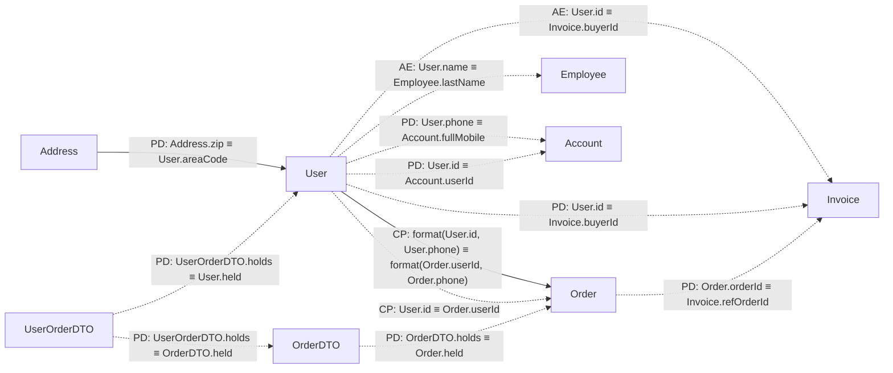

# classRelationTestCode — 字段关联分析报告

## 摘要

| 项目 | 数值 |
|---|---|
| 涉及类关系对（直接） | 9 |
| 探测型关联（READ） | 2 |
| 动作型关联（WRITE） | 11 |
| 推导关联（传递闭包） | 0 |

## 关联图谱

> 实线箭头 `-->` 为探测型（READ），虚线箭头 `-.->` 为动作型（WRITE）。

## 字段血缘明细

### User

| 目标表字段 | 源表字段集合 | 映射类型 | 模式 | 代码位置 | 归一化操作 |
|---|---|---|---|---|---|
| `User.areaCode` | `Address.zip` | PARAMETERIZED | READ | `CustomService.java:31` | `toLowerCase()` |
| | *address.getZip().toLowerCase().equals(user.getAreaCode())* | | | |
| `User.held` | `UserOrderDTO.holds` | PARAMETERIZED | WRITE | `main(composition)` |
| | *userOrderDTO.getUser()* | | | |
| `User.held` | `UserOrderDTO.holds` | PARAMETERIZED | WRITE | `main(composition)` |
| | *userOrderDTO.getUser()* | | | |

### Order

| 目标表字段 | 源表字段集合 | 映射类型 | 模式 | 代码位置 | 归一化操作 |
|---|---|---|---|---|---|
| `Order.userId`, `Order.phone` | `User.id`, `User.phone` | COMPOSITE | READ | `CustomService.java:58` |
| | *userAndPhone.equals(userAndPhone2)* | | | |
| `Order.userId` | `User.id` | COMPOSITE | WRITE | `CustomService.java:14` |
| | *order.userId = "P" + id* | | | |
| `Order.held` | `OrderDTO.holds` | PARAMETERIZED | WRITE | `main(composition)` |
| | *userOrderDTO.getOrderDTO().getOrder()* | | | |

### Invoice

| 目标表字段 | 源表字段集合 | 映射类型 | 模式 | 代码位置 | 归一化操作 |
|---|---|---|---|---|---|
| `Invoice.buyerId` | `User.id` | ATOMIC | WRITE | `CustomService.java:38` |
| | *invoice.setBuyerId(user.getId())* | | | |
| `Invoice.buyerId` | `User.id` | PARAMETERIZED | WRITE | `generateInvoice(projected)` |
| | *invoice.setBuyerId(user.getId())* | | | |
| `Invoice.refOrderId` | `Order.orderId` | PARAMETERIZED | WRITE | `generateInvoice(projected)` |
| | *invoice.setRefOrderId(orderId)* | | | |

### Employee

| 目标表字段 | 源表字段集合 | 映射类型 | 模式 | 代码位置 | 归一化操作 |
|---|---|---|---|---|---|
| `Employee.lastName` | `User.name` | ATOMIC | WRITE | `CustomService.java:47` |
| | *employee.setLastName(user.getName())* | | | |

### OrderDTO

| 目标表字段 | 源表字段集合 | 映射类型 | 模式 | 代码位置 | 归一化操作 |
|---|---|---|---|---|---|
| `OrderDTO.held` | `UserOrderDTO.holds` | PARAMETERIZED | WRITE | `main(composition)` |
| | *userOrderDTO.getOrderDTO()* | | | |

### Account

| 目标表字段 | 源表字段集合 | 映射类型 | 模式 | 代码位置 | 归一化操作 |
|---|---|---|---|---|---|
| `Account.fullMobile` | `User.phone` | PARAMETERIZED | WRITE | `main(constructor-call)` |
| | *new Account(userOrderDTO.getUser().getPhone(), userOrderDTO.getUser().getId())* | | | |
| `Account.userId` | `User.id` | PARAMETERIZED | WRITE | `main(constructor-call)` |
| | *new Account(userOrderDTO.getUser().getPhone(), userOrderDTO.getUser().getId())* | | | |

