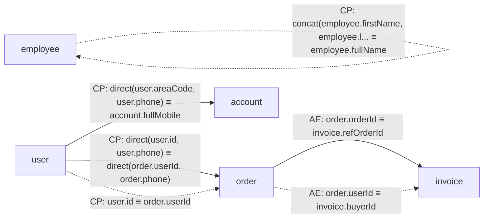

# classRelationTestCode — 字段关联分析报告

## 摘要

| 项目 | 数值 |
|---|---|
| 涉及类关系对 | 4 |
| 探测型关联（READ） | 3 |
| 动作型关联（WRITE） | 3 |

## 关联图谱

> 实线箭头 `-->` 为探测型（READ），虚线箭头 `-.->` 为动作型（WRITE）。

## 字段血缘明细

### invoice

| 目标表字段 | 源表字段集合 | 映射类型 | 模式 | 代码位置 |
|---|---|---|---|---|
| `invoice.refOrderId` | `order.orderId` | ATOMIC | READ | `AtomicReadService.java:21` |
| | *order.orderId.equals(invoice.refOrderId)* | | | |
| `invoice.buyerId` | `order.userId` | ATOMIC | WRITE | `AtomicWriteService.java:23` |
| | *invoice.buyerId = order.userId* | | | |

### employee

| 目标表字段 | 源表字段集合 | 映射类型 | 模式 | 代码位置 |
|---|---|---|---|---|
| `employee.fullName` | `employee.firstName`, `employee.lastName` | COMPOSITE | WRITE | `CompositeWriteService.java:23` |
| | *employee.fullName = employee.firstName + " " + employee.lastName* | | | |

### account

| 目标表字段 | 源表字段集合 | 映射类型 | 模式 | 代码位置 |
|---|---|---|---|---|
| `account.fullMobile` | `user.areaCode`, `user.phone` | COMPOSITE | READ | `CompositeReadService.java:21` |
| | *(user.areaCode + user.phone).equals(account.fullMobile)* | | | |

### order

| 目标表字段 | 源表字段集合 | 映射类型 | 模式 | 代码位置 |
|---|---|---|---|---|
| `order.userId`, `order.phone` | `user.id`, `user.phone` | COMPOSITE | READ | `CustomService.java:20` |
| | *userAndPhone.equals(userAndPhone2)* | | | |
| `order.userId` | `user.id` | COMPOSITE | WRITE | `CustomService.java:11` |
| | *order.userId = "P" + id* | | | |

