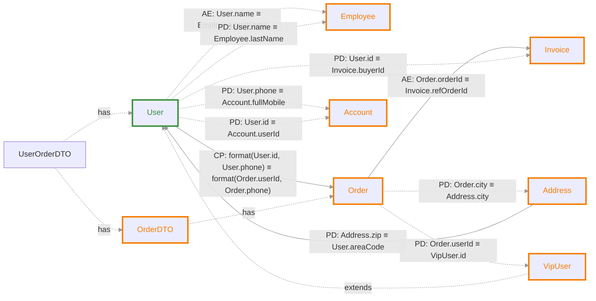

# classRelationTestCode — 字段关联分析报告

## 摘要

| 项目 | 数值 |
|---|---|
| 涉及类关系对（直接） | 11 |
| 探测型关联（READ） | 4 |
| 动作型关联（WRITE） | 17 |
| 推导关联（传递闭包） | 1 |

## 关联图谱

> 实线箭头 `-->` 为探测型（READ），虚线箭头 `-.->` 为动作型（WRITE）。

### 关系类型说明

| 缩写 | 全称 | 含义 | 示例 |
|---|---|---|---|
| **AE** | Atomic Equality | 原子等值：单字段对单字段的直接映射 | `A.id ≡ B.userId` |
| **CP** | Composite Projection | 投影组合：多字段组合或拼接后的映射 | `A.f1 + A.f2 ≡ B.full` |
| **PD** | Parameterized / Derived | 参数化/派生：经过转换、归一化或依赖上下文的映射 | `A.code.toLowerCase() ≡ B.value` |

### 继承关系

| 子类 | 父类 | 继承字段 |
|---|---|---|
| `VipUser` | `User` | `areaCode, phone, tenantId, id, name` |

## 字段血缘明细

### Employee

| 目标表字段 | 源表字段集合 | 映射类型 | 模式 | 代码位置 | 归一化操作 |
|---|---|---|---|---|---|
| `Employee.lastName` | `User.name` | ATOMIC | WRITE | `RecursiveCallTest.java:28` |
| | *employee.setLastName(user.getName())* | | | |
| `Employee.lastName` | `User.name` | PARAMETERIZED | WRITE | `iterateCall(direct-setter)` |
| | *// 字段映射：user.name -> employee.lastName employee.setLastName(user.getName())* | | | |

### Order

| 目标表字段 | 源表字段集合 | 映射类型 | 模式 | 代码位置 | 归一化操作 |
|---|---|---|---|---|---|
| `Order.userId`, `Order.phone` | `User.id`, `User.phone` | COMPOSITE | READ | `CompositeProjectionTest.java:21` |
| | *userAndPhone.equals(orderAndPhone)* | | | |
| `Order.held` | `OrderDTO.holds` | PARAMETERIZED | WRITE | `buildAddressFromOrder(composition)` |
| | *orderDTO.getOrder()* | | | |
| `Order.held` | `OrderDTO.holds` | PARAMETERIZED | WRITE | `extractOrderId(composition)` |
| | *userOrderDTO.getOrderDTO().getOrder()* | | | |
| `Order.held` | `OrderDTO.holds` | PARAMETERIZED | WRITE | `testVipUserInheritedFields(composition)` |
| | *orderDTO.getOrder()* | | | |

### Invoice

| 目标表字段 | 源表字段集合 | 映射类型 | 模式 | 代码位置 | 归一化操作 |
|---|---|---|---|---|---|
| `Invoice.refOrderId` | `Order.orderId` | ATOMIC | READ | `AtomicEqualityTest.java:19` |
| | *order.getOrderId().equals(invoice.getRefOrderId())* | | | |
| `Invoice.buyerId` | `User.id` | PARAMETERIZED | WRITE | `fillInvoice(projected)` |
| | *// 这里建立映射：userId -> invoice.buyerId, orderId -> invoice.refOrderId invoice.setBuyerId(userId)* | | | |
| `Invoice.buyerId` | `User.id` | PARAMETERIZED | WRITE | `fillInvoice(projected)` |
| | *invoice.setBuyerId(userId)* | | | |

### User

| 目标表字段 | 源表字段集合 | 映射类型 | 模式 | 代码位置 | 归一化操作 |
|---|---|---|---|---|---|
| `User.areaCode` | `Address.zip` | PARAMETERIZED | READ | `NormalizationTest.java:16` | `toLowerCase()` |
| | *address.getZip().toLowerCase().equals(user.getAreaCode())* | | | |
| `User.areaCode` | `Address.zip` | PARAMETERIZED | READ | `BuilderPatternTest.java:25` | `toLowerCase()` |
| | *address.getZip().toLowerCase().equals(user.getAreaCode())* | | | |
| `User.held` | `UserOrderDTO.holds` | PARAMETERIZED | WRITE | `createAccountFromUser(composition)` |
| | *userOrderDTO.getUser()* | | | |
| `User.held` | `UserOrderDTO.holds` | PARAMETERIZED | WRITE | `createAccountFromUser(composition)` |
| | *userOrderDTO.getUser()* | | | |
| `User.held` | `UserOrderDTO.holds` | PARAMETERIZED | WRITE | `extractUserPhone(composition)` |
| | *userOrderDTO.getUser()* | | | |

### Address

| 目标表字段 | 源表字段集合 | 映射类型 | 模式 | 代码位置 | 归一化操作 |
|---|---|---|---|---|---|
| `Address.city` | `Order.city` | PARAMETERIZED | WRITE | `buildAddressFromOrder(builder)` |
| | *Address.builder().city(orderDTO.getOrder().getCity())* | | | |

### Account

| 目标表字段 | 源表字段集合 | 映射类型 | 模式 | 代码位置 | 归一化操作 |
|---|---|---|---|---|---|
| `Account.fullMobile` | `User.phone` | PARAMETERIZED | WRITE | `createAccountFromUser(constructor-call)` |
| | *new Account(userOrderDTO.getUser().getPhone(), userOrderDTO.getUser().getId())* | | | |
| `Account.userId` | `User.id` | PARAMETERIZED | WRITE | `createAccountFromUser(constructor-call)` |
| | *new Account(userOrderDTO.getUser().getPhone(), userOrderDTO.getUser().getId())* | | | |
| `Account.fullMobile` | `User.phone` | PARAMETERIZED | WRITE | `createSimpleAccount(constructor-call)` |
| | *new Account(user.getPhone(), user.getId())* | | | |
| `Account.userId` | `User.id` | PARAMETERIZED | WRITE | `createSimpleAccount(constructor-call)` |
| | *new Account(user.getPhone(), user.getId())* | | | |

### OrderDTO

| 目标表字段 | 源表字段集合 | 映射类型 | 模式 | 代码位置 | 归一化操作 |
|---|---|---|---|---|---|
| `OrderDTO.held` | `UserOrderDTO.holds` | PARAMETERIZED | WRITE | `extractOrderId(composition)` |
| | *userOrderDTO.getOrderDTO()* | | | |

### VipUser

| 目标表字段 | 源表字段集合 | 映射类型 | 模式 | 代码位置 | 归一化操作 |
|---|---|---|---|---|---|
| `VipUser.id` | `Order.userId` | PARAMETERIZED | WRITE | `testVipUserInheritedFields(direct-setter)` |
| | *// VipUser 继承自 User，可以使用 id 字段 vipUser.setId(orderDTO.getOrder().getUserId())* | | | |

## 推导关联（传递性闭包）

> 以下关联由工具自动推导，非源码直接体现。

### VipUser

| 目标表字段 | 源表字段集合 | 推导路径 |
|---|---|---|
| `VipUser.id` | `User.id`, `User.phone` | *[User.id, User.phone] → [Order.userId, Order.phone] → VipUser.id* |

